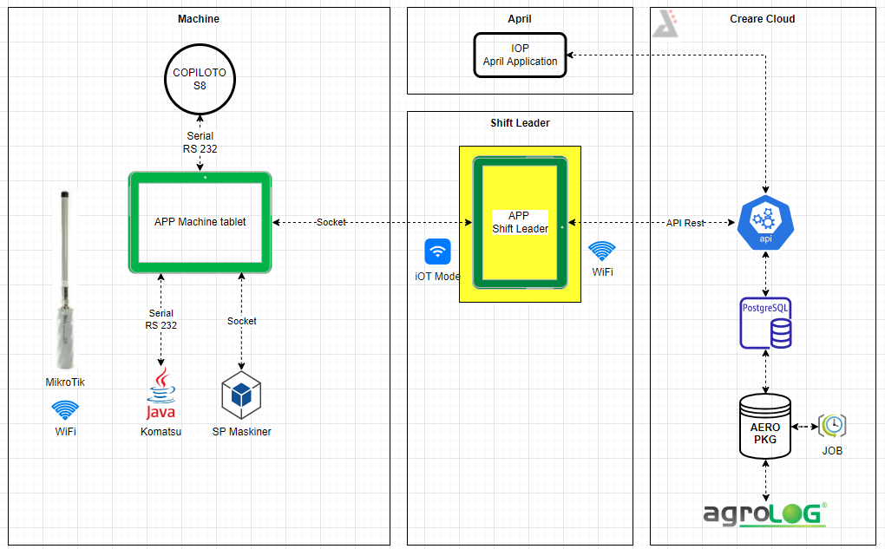

# shift-leader

App Android responsável por fazer a coleta dos dados do Machine Tablet e enviar para a Cloud da Creare.

# Versão 3.1.0

- Melhoria na listagem de máquinas
- Melhoria nos métodos de conexão wifi
- Melhoria nos métodos de sincronismo com API
- Refactor geral, simplificando classes e eliminando arquivos desnecessários
- Implementado controle de GET para elementos por update_date
- Modificado método de POST para ser síncrono e sequencial

